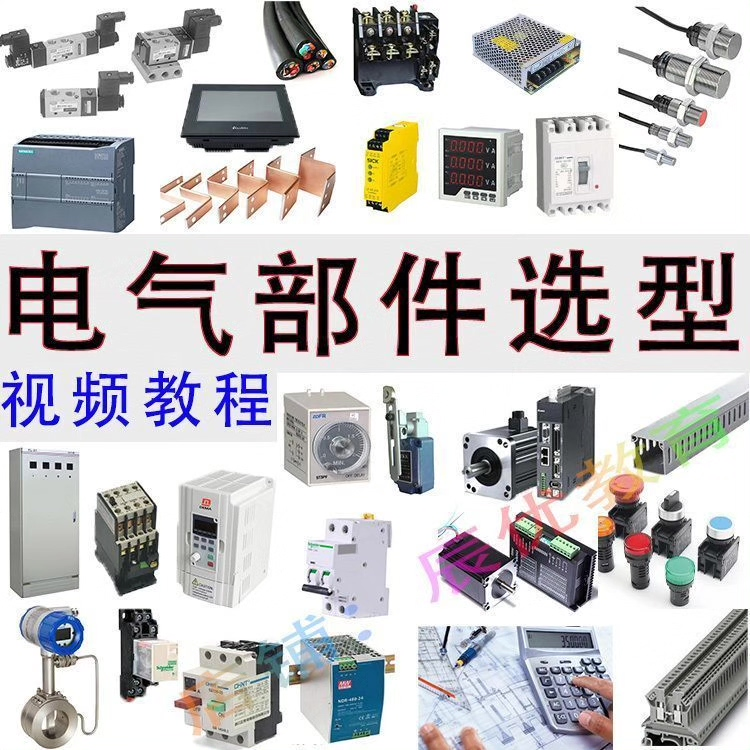
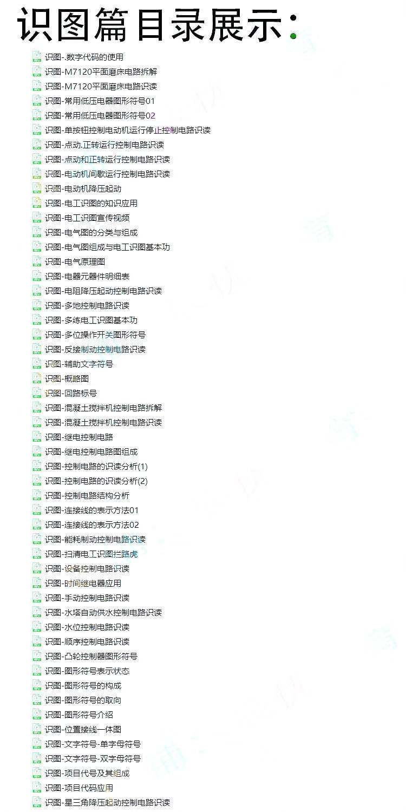
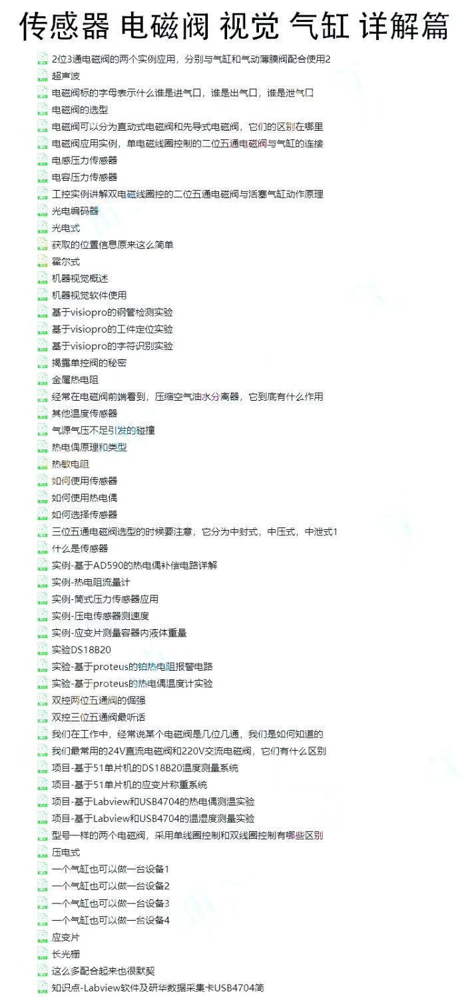
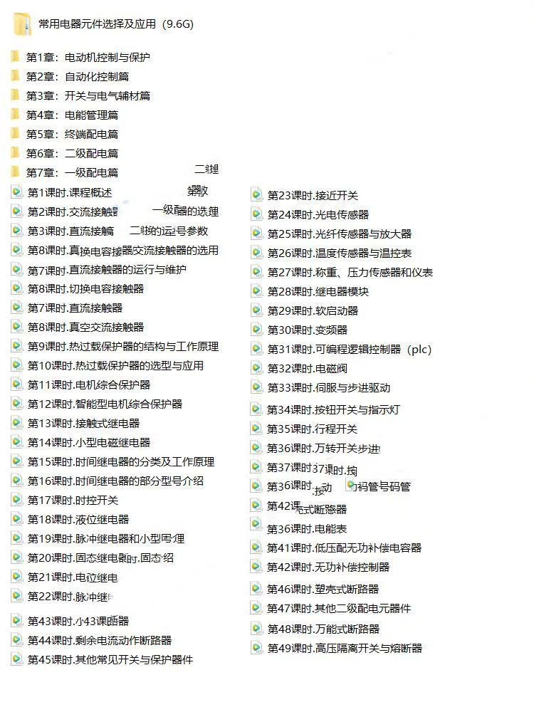
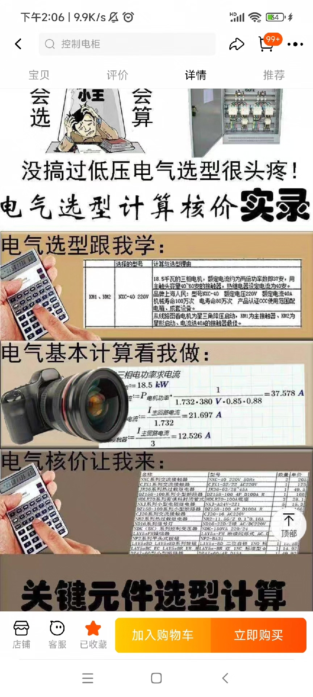

# Electrical Component Selection Video Tutorial Learning Low Voltage PLC Control Electric Cabinet Valuation and Calculations for Diagram Reading Basics of Electrical Engineering

## Body

Electrical Component Selection Video Tutorials for Low Voltage PLC Control Cabinets Valuation and Calculation of Diagrams Basic Electrical Engineering

Electronic and electrical component selection video tutorials, learning low-voltage PLC control cabinet pricing calculation, recognition of drawings, basic knowledge for electricians.

The practical teaching video case explains the analysis, calculation, selection and assembly process of electrical automation components, helping engineers complete projects from scratch to mastery. This comprehensive project tutorial covers everything from zero to advanced knowledge, and is available for reference by those with some foundational understanding at any time.

Review the selection materials and videos related to the review of components.

Welcome to visit our store at any time to purchase suitable tutorials and automation structure design materials.
The collection and organization of electronic file materials are not easy, and after sale, we do not accept returns or exchanges, thank you for your patronage and support!

## Images

## Payment

Here is a pay link on Stripe ( https://buy.stripe.com/3cs8yP7sY87d0vu9AB ). Please contact me lonlonago@foxmail.com after funding $89, and I will send you a complete data files , thank you!

